# Collection API

- 같은타입의 데이터를 메모리에 효율적으로 저장하기 위해 쓰임

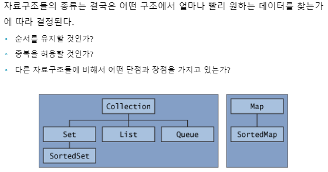

## Generic

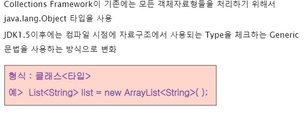

- 제네릭에 들어올 수 있는 타입은 참조 자료형만 가능함

## List

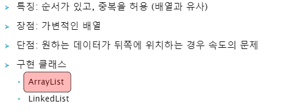

- 모든 데이터에 접근할 수 있다. 하지만, 순서가 있기때문에 앞쪽 인덱스는 빠르게 접근할 수 있는데, 뒤로 갈 수록 데이터 검색 속도가 느려짐 => 데이터를 검색용으로 사용하는거면, List는 비효율적
- 객체를 만들 수 없음 (interface)
- 따라서 구현클래스를 만들기 위해 ArrayList, LinkedList를 사용

ArrayList는 인덱스로 데이터를 관리하지만 **LinkedList**는 인접한 곳을 링크하여 체인처럼 관리**한다. LinkedList는 중간의 데이터를 삭제할 때 인접한 곳의 링크만을 변경하면 되기 때문에 **중간에 데이터를 추가/삭제하는 경우 처리 속도가 빠르다**.** 

[출처]** http://blog.naver.com/heartflow89/220991199432

## **ArrayList - 메소드 **

#### 1. add : 데이터 입력

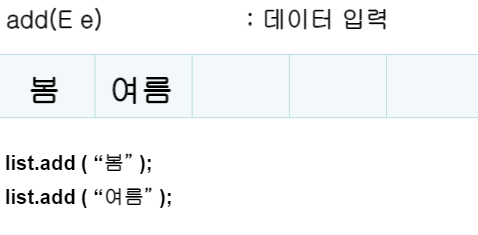

#### 2. get(int index) : 데이터 추출

#### 3. size() :  크기 반환

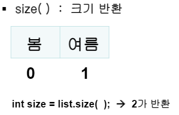

####  

#### 4. remove (int i ): 인덱스 위치의 데이터를 삭제

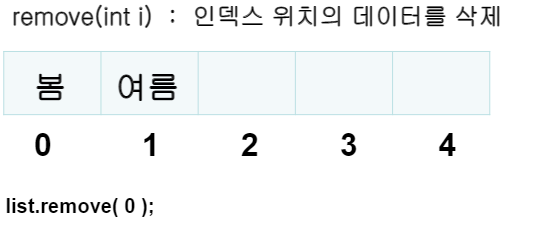

- 봄을 지우게 되면, 여름이 0번째 인덱스로 인식이 된다.

- 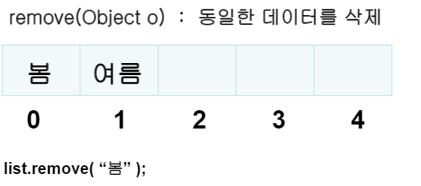

- 만약  2번째 인덱스에도 봄이 있다면, 0번째 인덱스에 있는 봄부터 지워지게 되고, 여름이 0번째, 봄이 1번째 인덱스로 바뀌게 된다.

### 5. clear() : 모든데이터 삭제

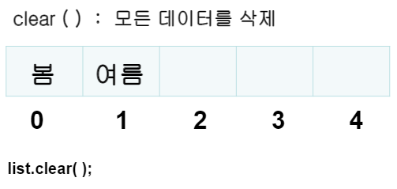

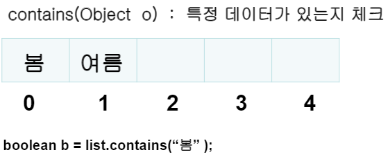

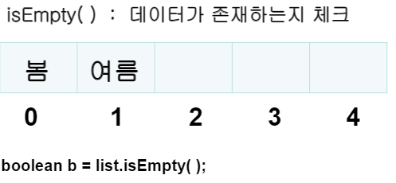

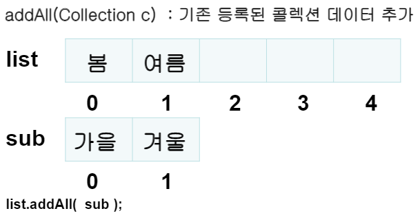

- list : 봄0 여름1 가을2 겨울 4, sub 가을0 겨울1 (sub는 그대로 가지고 있음)

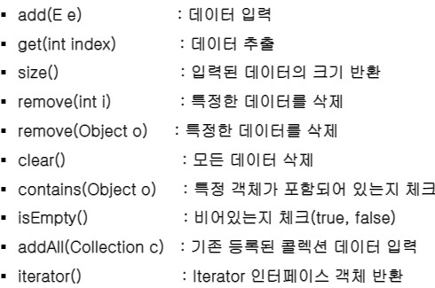

## set

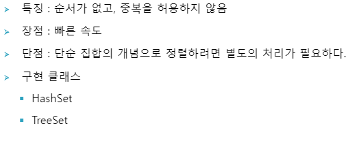HashSet , TreeSet => 빠른 속도를 위해 사용(검색의 목적)(일반적으로 HashSet을 더 많이 사용)

Set은 get메소드 존재 x => index가 존재하지 않기 때문

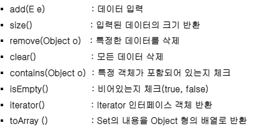

## Map

- set은 데이터에 대한 중복, map은 키에대한 중복을 허용 X

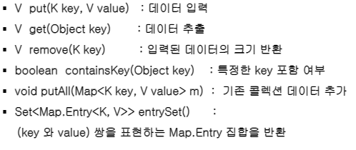

- 인자값에는 대부분 KEY  값이 들어감.

- set은 중복된 데이터 값을 넣을 수가 없는데, map은 동일한 키값이 있을경우, value값을 새로운 값으로 대체하고 기존 값 반환 (value overwritten)

**LinkedHashMap과 TreeMap**

Map의 가장 큰 특징은 순서에 의존하지 않고 key로 value를 가져오는데 있다. 하지만 가끔은 Map에 입력된 순서대로 데이터를 가져오고 싶은 경우도 있고 때로는 입력된 key에 의해 소트된 데이터를 가져오고 싶을 수도 있을 것이다. 이런경우에는 LinkedHashMap과 TreeMap을 사용하는 것이 유리하다.

- LinkedHashMap은 입력된 순서대로 데이터가 출력되는 특징을 가지고 있다.
- TreeMap은 입력된 key의 소트순으로 데이터가 출력되는 특징을 가지고 있다.