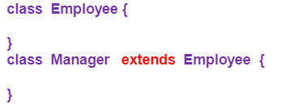
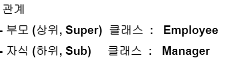
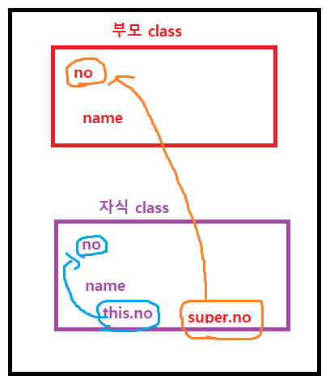
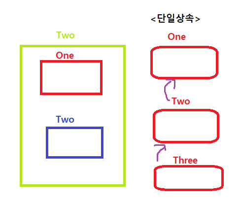
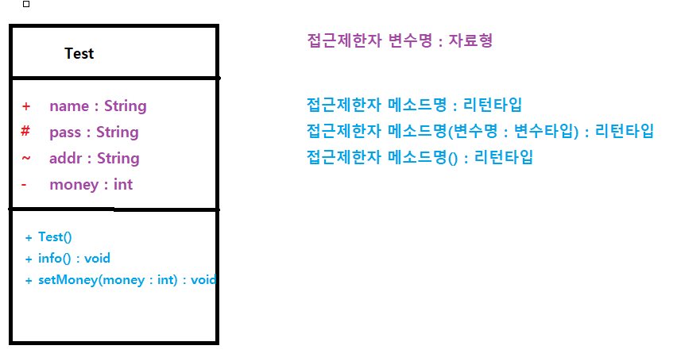
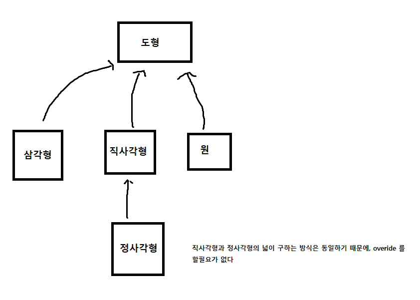

## 객체지향프로그래밍 - 상속 

**=> Manager 클래스는 Employee를 상속받았다 **

**=> 자식클래스에서  this.변수(부모클래스의) 사용 가능함 !**

#### <상속의 장점>

**1. 자식클래스는 부모클래스에 선언 되어 있는 멤버변수, 메소드를 자신의 것처럼 사용할 수 있다.**

- super를 통해 부모클래스의 변수,메서드 생성자 호출가능

  - super생성자와 this생성자와 같이 쓸 수 없음(둘다 생성자 내에 가장 윗줄에 와야되기 때문)

  - 이러한 이유로  super생성자는 기본적으로 생략이 되어있음 => this생성자를 쓸 수 있다.

- 하나의 sub클래스는 하나의 super클래스만 상속받을 수 있다(단일상속)

#### <메소드 오버라이딩>

메소드의 이름은 부모클래스의 메소드와 동일하게 하되, 자식클래스에서 다른 기능을 할 수 있는 메소드로 재정의 하는것

- 상속관계에서 발생한다.
- 메소드 선언 부분에서 접근 제한자 부분은 다를 수 있다.
  - 단, 하위클래스 접근 제한자가 상위클래스 접근제한자 보다 좁으면 안된다.

**접근범위> public > protected > default > private **

**부모의 접근제한자보다, 자식의 접근제한자가 넓어야한다(= 부모보다 공개범위가 더 커야한다)**

### Java에서 기본적으로 제공하는 어노테이션 종류

1. **@Override**

- 선언한 메서드가 오버라이드 되었다는 것을 나타냅니다.
- 만약 상위(부모) 클래스(또는 인터페이스)에서 해당 메서드를 찾을 수 없다면 컴파일 에러를 발생 시킵니다.

2. **@Deprecated**

- 해당 메서드가 더 이상 사용되지 않음을 표시합니다.
- 만약 사용할 경우 컴파일 경고를 발생 키십니다.

3. **@SuppressWarnings**

- 선언한 곳의 컴파일 경고를 무시하도록 합니다.

4. **@SafeVarargs**

- Java7 부터 지원하며, 제너릭 같은 가변인자의 매개변수를 사용할 때의 경고를 무시합니다.

5. **@FunctionalInterface**

- Java8 부터 지원하며, 함수형 인터페이스를 지정하는 어노테이션입니다.
- 만약 메서드가 존재하지 않거나, 1개 이상의 메서드(default 메서드 제외)가 존재할 경우 컴파일 오류를 발생 시킵니다.

#### 접근제한자

### 클래스 다이어그램

### Square.java  ###

