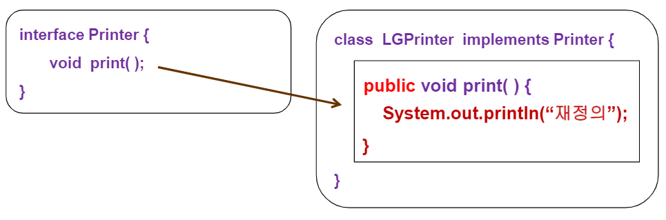
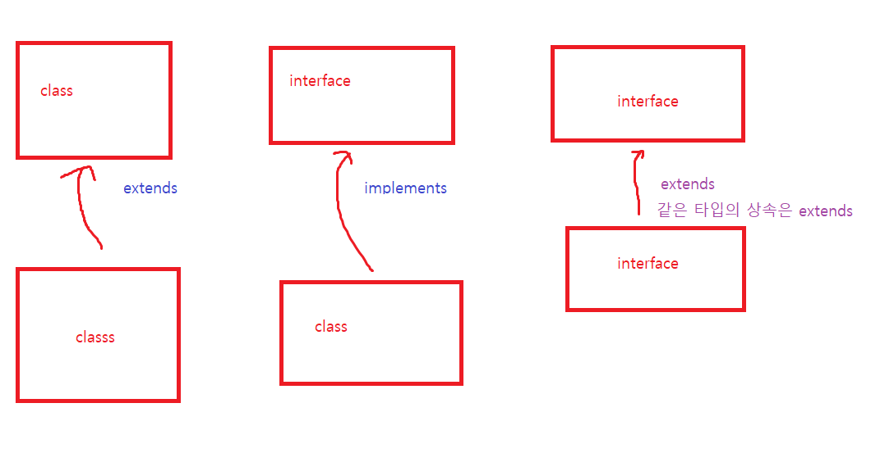

## 객체지향프로그래밍 - 인터페이스

https://limkydev.tistory.com/197		-- 참고 링크\

- 인터페이스는 추상메소드와 상수만 가지고 있다.

- 클래스 안에 **기능을 추가하는**  수단 중 하나임

- 인터페이스는 다중 상속을 지원 

- 인터페이스에 선언되는 수는 모두 상수로 적용

  

  - public static final 이 생략되어있음

- 선언되는 메소드는 모두 추상 메소드로 적용

  

- 인터페이스는 추상클래스의 집합이기 때문에,  abstract 키워드를 생략할 수 있다. (모든 메소드의 접근제한자는 public) => 모든 클래스에 달라붙을 수 있게하려고

- 객체 생성이 불가능하다 ( new() x  => 추상클래스와 동일한 특성)

- 클래스가 인터페이스를 상속할경우에는 extends 키워드가 아니라implements 키워드를 이용

- 인터페이스를 상속받는 하위클래스는 추상메소드를 반드시 오버라이딩(재정의) 해야한다. **시험문제 나옴**!

  

  - 인터페이스의 모든 접근제어자는 public이기 때문에, 오버라이딩 메소드 또한 public으로 만들어야 한다. ( 안쓰면 오류 !)

**내부클래스에서만 사용되는 메소드는  private으로 해주자**

impliments는 클래스 - 인터페이스 일 경우에 쓴다.

abstract class - interface 관계도 implements

인터페이스 - 인터페이스 의 상속관계는 extends로 !

### final의 3가지 사용법

- 변수 : 상수
- 메소드 : 오버라이딩 금지

- 클래스 :  상속금지

**인터페이스는 추상메소드만 가지는 것이 맞다.
but ! 향후 유지보수의 과정에서, 일반 메소드가 필요할때  default 메소드는 이용할 수 있다. 
처음에 인터페이스를 구성할때부터 쓰는 것이 아님!**