## 추상클래스

https://limkydev.tistory.com/188		-- 참고 링크

https://limkydev.tistory.com/77  		-- 객체 지향 설계란? (SOLID)

**1. 추상클래스는 하나의 추상메소드를 가지고 있어야 한다.**

**2. 추상클래스는 인스턴스 생성이 불가능함(new 키워드 사용 불가능)**

- **인스턴스 생성을 하려면, 자식클래스를 이용해야함**

**3. 추상 메소드를 포함하는 클래스는 반드시 추상클래스로 정의되야함**

​	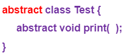

- **자식클래스에서 추상메소드를  Overide**

**4. 추상클래스는 구현된(일반) 메소드와 추상 메소드 모두 선언 가능**

​	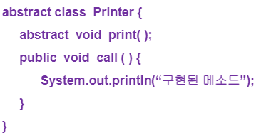

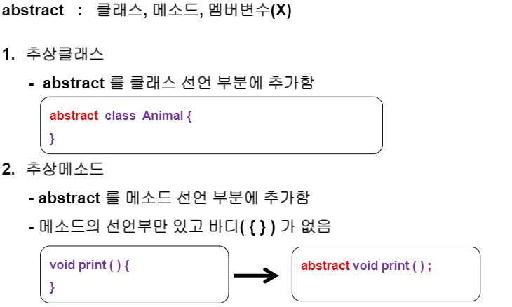

- 바디부분이 없어지면서, 뒤에 세미콜론이 붙는다.

### < 추상클래스를 만드는 가장 큰 특징>

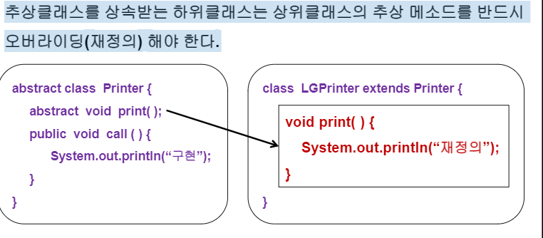

**또는 LGPrinter 클래스 또한 추상클래스로 만들면 된다.**

### < 객체 형변환 - 묵시적 >

https://limkydev.tistory.com/75 -- 참고링크

- **대입 연산자를 기준으로 좌변과 우변의 데이터 타입이 다른 경우에 발생**

- 좌변과 우변항에 있는 서로 다른 타입이, **상속관계**인 경우에만 개체형변환이 발생

- 왼쪽 객체가 오른쪽 객체의 상위 클래스인 경우에만 묵시적 형변환 발생

- 부모클래스의 참조변수가 자식클래스의 주소값을 가르키게 된다.

  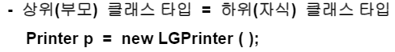

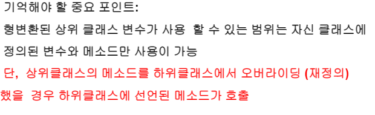

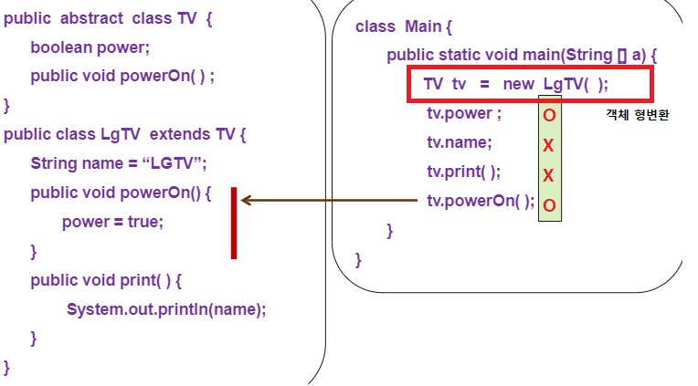

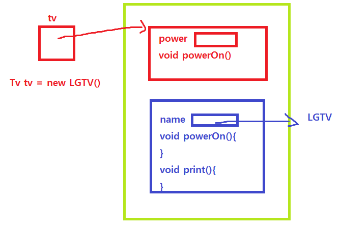

-   Tv의 tv참조변수가 LGTV의 주소값을 가르킨다.

tv.power : 접근  가능 => 부모클래스의 멤버변수이기 때문에 접근이 가  능함.

tv.name : 접근 불가능  => 부모클래스의 멤버변수와 메소드만 사용이 가능하기 때문

tv.print() : 접근 불가능 => 부모클래스의 멤버변수와 메소드만 사용이 가능하기 때문

tv.powerOn() : 접근 가능 = > 메소드가 하위 클래스에서 오버라이딩되었다면 오버라이딩된 메소드 호출

### < 객체 형변환 - 명시적 >

- 좌변에 자식클래스 , 우변에 부모클래스 = > 부모의 공간을 자식이 가르킨다
- 상위타입의 묵시적 형변환이 되어있는 변수만 우변에 올 수 있다.

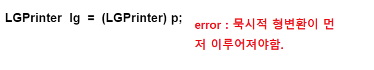

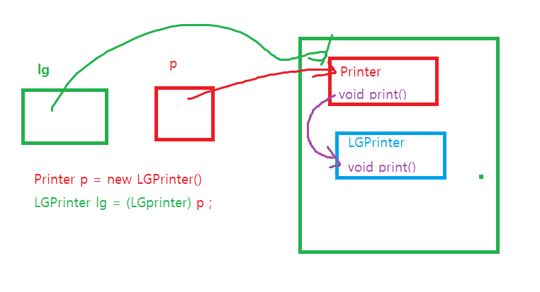

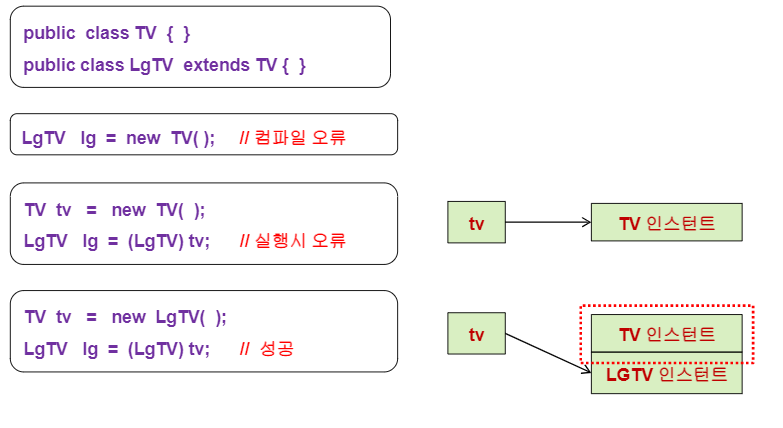

### instanceof 연산자

- 참조변수가 참조하고 있는 인스턴스의 실제 타입을 알아보기 위해 instanceof 연산자를 사용합니다. 
- 주로 조건문에 사용되며, instanceof의 왼쪽에는 참조변수를 오른쪽에는 타입(클래스명)이 피연산자로 위치합니다. 그리고 연산의 결과로 boolean값인 true, false 중의 하나를 반환 합니다.

\- 객체의 묵시적 형변환은 사용할 수 있는 멤버 변수를 제한하는 것

\- 객체의 명시적 형변환은 제한된 멤버 변수를 다시 사용할 수 있게 만드는 것

