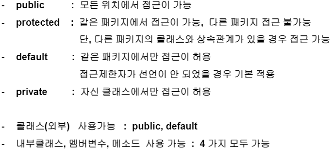

객체지향프로그래밍 정리

### **생성자**

생성자 - 멤버변수들을 초기화 하기 위한 목적

생성자의 특징

- 생성자는 반환타입이 없다.

- 생성자는 default 형태를 지원(형태는 매개변수가 없는 형태), 오버로딩 지원(클래스 내에 메소드 이름이 같고 매개변수 타입 또는 개수가 다른것)

- 객체를 생성할 때 속성의 초기화를 담당하게 한다

- this의 활용

  ​	this.멤버변수, this(인자값):생성자 호출

  - static 영역에서는 사용이 불가능 

  - this 생성자 호출시 제한사항 : 생성자 내에서만 호출이 가능 ,가장 첫번째 구문에 위치해야 함

###  **static**- 공유의 목적

1. 로딩시점 :

   static : 클래스 로딩시

   nonstatic : 객체 생성시

2. 메모리할당

   static : 클래스당 하나의 메모리 공간만 할당

   nonstatic : 인스턴스 당 메모리가 별도로 할당

3. 사용상의 차이

   static :  클래스명.  으로 접근

   nonstatic : 객체 생성 후 접근

스태틱 메소드에서는 인스턴스,일반 메소드 호출 x

### **상속**

1. 재사용성과 확장성

   자식클래스는 부모클래스에 선언 되어 있는 멤버변수,  메소드를 자신의 것처럼 사용할 수 있다. 단, 접근제한자에 따라 사용여부가 달라진다. 

2. extends 키워드

3. super 키워드

4. 오버라이딩

   상속관계에서 발생한다.

   메소드 선언 부분에서 접근 제한자 부분은 다를 수 있다.

   - 단, 하위클래스 접근 제한자가 상위클래스 접근제한자 보다 좁으면 안된다.

   

**접근제한자**  4가지

**부모의 접근제한자보다, 자식의 접근제한자가 넓어야한다(= 부모보다 공개범위가 더 커야한다)**

**추상클래스**

1. abstract 키워드
2. 추상메소드
3. 인스턴스 생성여부
4. 일반메소드와 추상메소드 모두 가능
5. 하위클래스에서 해야할 일
6. 추상클래스 객체 변수 얻기

**객체 형변환**

1. 정의
2. 조건
3. 종류

**인터페이스**

1. 선언되는 메소드
2. 선언되는 변수
3. 인스턴스 생셩여부
4. 하이클래스에서 해야할 일
5. 인터페이스 객체 변수 얻기

**final**

1. 변수에 적용	-- 변수변경 금지
2. 메소드에 적용 -- 오버라이드 금지
3. 클래스에 적용 - 상속금지

**예외처리 금지**

1. try

2. catch

3. finally

4. throws

5. throw -- 예외가 발생할 시점이 아닌데, 내가 예외를 발생시키고 싶을때

   

