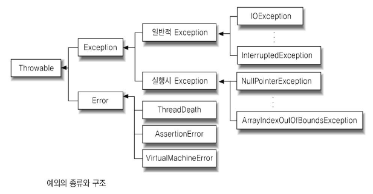
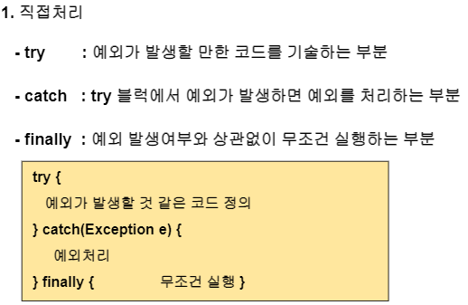
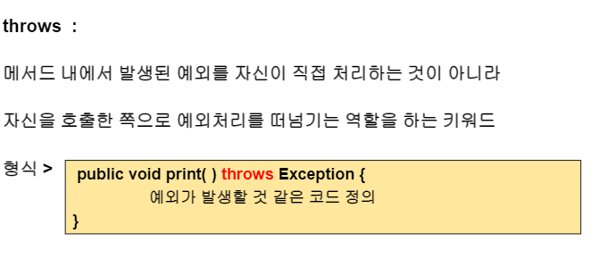
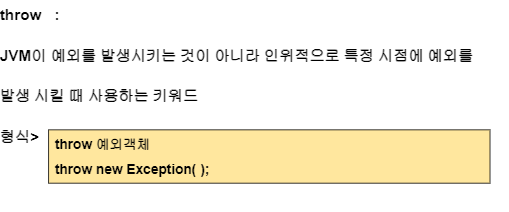
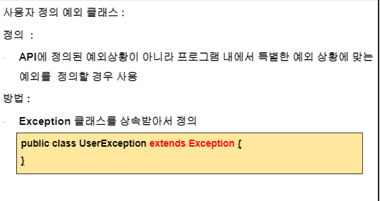

## 예외

### **소프트웨어가 강제적으로 종료되지 않기를 바랄때 사용함.**

**개발자가 예기치 못한 예외가 발생할 것을 대비하여 예외처리를 한다**

**예외 vs 에러?**

- **예외 :** 일반적으로 생기는 문자들(개발자가 프로그램을 잘못 작성함으로써 발생하는것) (파이썬은 에러라고 나옴)

- **에러 :** 프로그램을 실행하는데, 나의 문제가 아니라 시스템의 문제(JVM ..등) 개발자와 상관이 없는 것

- 예외는 컴파일시점과 실행시점으로 나눌수있음
  - 이클립스에서 빨간줄 쳐지는게 **컴파일시점(checked exceptipon)** => 문법상 예외
  - 컴파일시점에는 예외처리가 안됐는데, 실제로 Run을 했더니 발생하는 예외는 실행시점

- 주로 인터페이스나 추상클래스에서 추상메소드를 정의할때 사용함.

